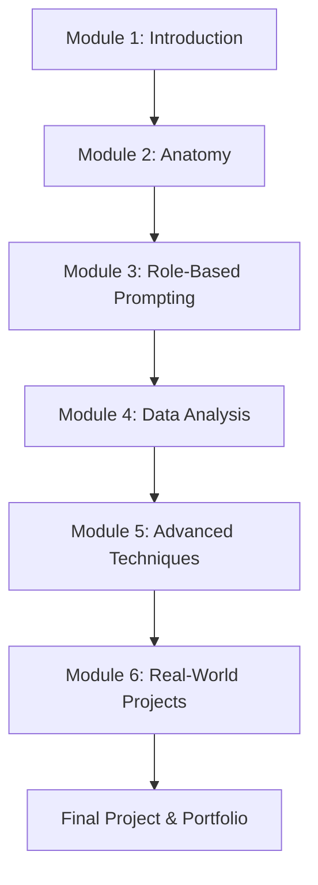

# 🧠 Mastering Prompt Engineering: Use ChatGPT as an Analyst

> **Interactive Workshop**  
> **Duration:** 60 minutes  
> **Format:** Live hands-on workshop  
> **Skill Level:** Beginner → Advanced  
> **Objective:** Master prompt engineering to transform ChatGPT into a powerful analytical assistant

---

## 🎯 Workshop Overview

This interactive workshop teaches you to harness the full power of ChatGPT through strategic prompt engineering. You'll learn to transform ChatGPT from a simple chatbot into a sophisticated data analyst capable of generating insights, creating reports, and solving complex analytical problems.

**Workshop Format:**
- 🎯 **Live demonstrations** with real-time ChatGPT interactions
- 🤝 **Hands-on exercises** you'll complete during the session
- 💬 **Group discussions** and Q&A throughout
- 📝 **Take-home materials** for continued learning

### 🏆 What You'll Master
- ✅ **Prompt Engineering Fundamentals** - The science behind effective AI communication
- ✅ **Role-Based Prompting** - Transform ChatGPT into different professional personas
- ✅ **Data Analysis Techniques** - Extract insights from any dataset
- ✅ **Advanced Prompting Strategies** - Chain prompts, use system messages, and optimize outputs
- ✅ **Real-World Applications** - Build practical solutions for business problems

---

## 🎪 Workshop Structure

### 📖 **Module 1: Introduction to Prompt Engineering** (10 min)
- Live demo: Basic vs. engineered prompts
- Hands-on: Create your first structured prompt
- Group share: Compare results and discuss

### 🧩 **Module 2: Anatomy of Effective Prompts** (10 min)
- Live demo: The 4 pillars in action
- Hands-on: Build complete prompts together
- Quick share: Each table shares one element

### 🎭 **Module 3: Role-Based Prompting** (10 min)
- Live demo: How roles change responses
- Hands-on: Each table tests different roles
- Group demo: Each table demonstrates their role

### 📊 **Module 4: Data Analysis with ChatGPT** (15 min)
- Live demo: Complete data analysis example
- Hands-on: Each table analyzes provided dataset
- Presentations: Each table presents their insights

### ⚡ **Module 5: Advanced Techniques** (10 min)
- Live demo: Prompt chaining example
- Hands-on: Try chaining with your data
- Quick tips: Optimization strategies

### 🚀 **Module 6: Real-World Projects** (5 min)
- Live demo: Complete workflow example
- Planning: Participants plan their first project
- Wrap-up: Key takeaways and next steps

---

## 📋 Workshop Materials

### **For Participants**
- 📝 [Workshop Cheat Sheet](./WORKSHOP-CHEAT-SHEET.md) - Quick reference guide
- 🎯 [Workshop Modules](./WORKSHOP-MODULES.md) - Interactive format
- 📊 [Sample Datasets](./resources/datasets.md) - Practice data
- 📚 [Complete Course](./modules/) - Detailed self-paced modules

### **For Facilitators**
- 🎪 [Facilitator Guide](./WORKSHOP-FACILITATOR-GUIDE.md) - Complete setup and delivery guide
- 📊 [Prompt Templates](./resources/templates.md) - Ready-to-use prompts
- ❓ [FAQ](./faq.md) - Common questions and answers

---

## 🛠 Prerequisites

- ✅ Access to ChatGPT (GPT-4 recommended for best results)
- ✅ Basic computer literacy
- 🌐 Internet connection
- 📊 Optional: Sample datasets (provided in course)
- 💡 Curiosity and willingness to experiment

---

## 🎓 Learning Path

---

## 🏆 Course Completion

### 📋 Progress Tracking
Each module includes:
- ✅ Learning objectives
- 🧪 Hands-on exercises
- 📝 Checkpoints and assessments
- 🎯 Practical challenges
- 📚 Additional resources

### 🏅 Certificates & Badges
Complete all modules to earn:
- 🥇 **Prompt Engineering Fundamentals** badge
- 🥈 **Data Analysis Specialist** badge  
- 🥉 **Advanced AI Communicator** badge
- 🏆 **Master Prompt Engineer** certificate

---

## 🚀 Quick Start

1. **Start Here:** [Module 1: Introduction to Prompt Engineering](./modules/module-1-introduction.md)
2. **Follow the sequence** - Each module builds on the previous
3. **Complete exercises** - Hands-on practice is essential
4. **Track progress** - Use the checklists in each module
5. **Build your portfolio** - Document your learning journey

---

## 💡 Course Philosophy

This course is built on three core principles:

1. **🎯 Practical Learning** - Every concept is immediately applicable
2. **🔄 Iterative Improvement** - Learn through experimentation and refinement
3. **🚀 Real-World Focus** - Skills that solve actual business problems

---

## 📞 Support & Community

- 💬 **Discord Community:** [Join our prompt engineering community](https://discord.gg/prompt-engineering)
- 📧 **Email Support:** help@promptengineeringcourse.com
- 🐛 **Report Issues:** [GitHub Issues](https://github.com/your-repo/issues)
- 📚 **FAQ:** [Frequently Asked Questions](./faq.md)

---

## 📈 What Students Are Saying

> *"This course completely changed how I interact with AI. I went from basic questions to generating professional business reports!"* - Sarah M., Data Analyst

> *"The role-based prompting techniques are game-changing. ChatGPT now feels like having a team of experts on demand."* - Mike R., Product Manager

> *"Finally, a course that teaches the WHY behind prompt engineering, not just the HOW."* - Alex K., AI Researcher

---

## 🔄 Course Updates

- **v2.1** - Added advanced prompt chaining techniques
- **v2.0** - Complete redesign with 6-module structure
- **v1.5** - Added real-world project templates
- **v1.0** - Initial course launch

---

## 📚 Additional Resources

- 📖 [Prompt Engineering Guide](./resources/prompt-guide.md)
- 🎯 [Prompt Templates Library](./resources/templates.md)
- 🛠 [Tools & Extensions](./resources/tools.md)
- 📊 [Sample Datasets](./resources/datasets.md)
- 🎥 [Video Tutorials](./resources/videos.md)

---

**Ready to become a prompt engineering master?** 🚀

[Start with Module 1 →](./modules/module-1-introduction.md)

---

*Last updated: December 2024 | Course version: 2.1*